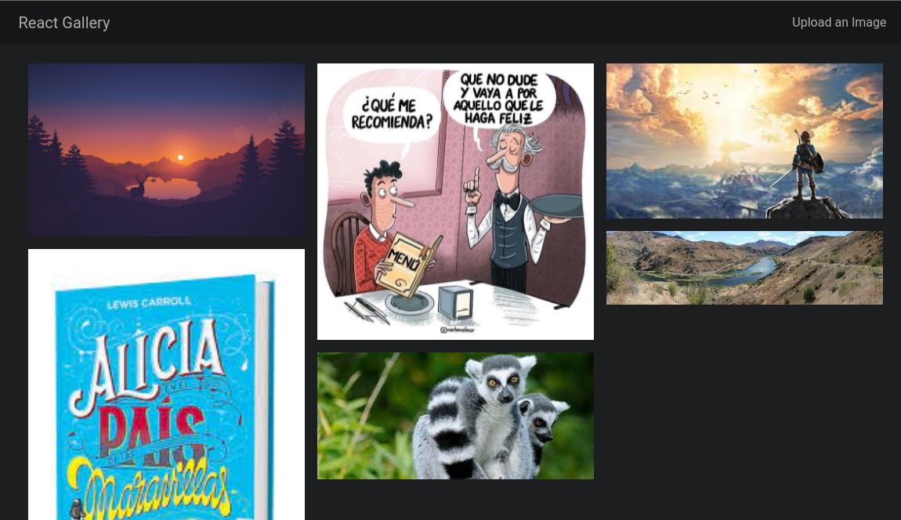

# REACT GALLERY

application to upload images to digital ocean (frontend and backend)

## Screenshots

### Home



### Upload Image


## Tools

- [Digital Ocean](https://www.digitalocean.com/) - Image storage
- [Heroku](https://dashboard.heroku.com/) - Deployment backend
- [Netlify](https://www.netlify.com/) - Deployment frontend

## Tech Stack

**Client:** ReactJs, Bootstrap, Css

**Server:** Node, Express, MongoDB, AWS

## Demo

link to [React Gallery](https://react-gallery-d.netlify.app/)

## Run Locally

Clone the project

```bash
  git clone https://github.com/Deyvis17GY/react-gallery-deyvis.git
```

Go to the project directory

```bash
  cd react-gallery-deyvis
```

Install dependencies

```bash
  yarn install
```

Start the server frontend

```bash
  yarn start
```

Start the server backend

```bash
  yarn server:dev
```

## Deployment

To deploy this project frontend

```bash
  yarn predeploy
```

To deploy this project backend

```bash
  yarn server:build
```

## Environment Variables

To run this project, you will need to add the following environment variables to your .env file

`MONGODB_URI` : connecting to your MongoDB database

`BUCKET_NAME` : the name of the bucket on AWS or digitalOcean

`AWS_ACCESS_KEY_ID` : the AWS Access KEY

`AWS_SECRET_ACCESS_KEY` : the AWS secret ID

`S3_ENPOINT` : the S3 o digitalOceanSpaces Endpoint

[Setup AWS credentials](https://docs.aws.amazon.com/sdk-for-java/v1/developer-guide/setup-credentials.html)

## License

[MIT](https://choosealicense.com/licenses/mit/)
